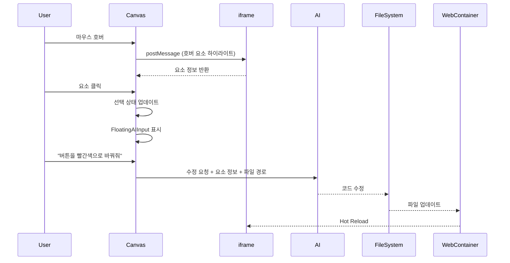

# Canvas-Page 연동 설계

> **작성일**: 2024-12-23  
> **상태**: 검토 대기

---

## 1. 개요

**목표**: 캔버스 탭에서 프로젝트의 실제 페이지를 표시하고, Figma처럼 요소를 선택한 후 AI를 통해 즉석 수정

### 핵심 결정 사항
| 항목 | 결정 |
|------|------|
| 렌더링 방식 | **하이브리드** (iframe 프리뷰 + 오버레이 선택) |
| 수정 방식 | **플로팅 AI 입력** (선택된 요소 위에 표시) |
| 적용 방식 | **즉시 적용** (변경 후 iframe 리로드) |
| 선택 방식 | **호버 하이라이트 + 클릭 선택** |

---

## 2. 아키텍처

```
┌─────────────────────────────────────────────────────┐
│                    Canvas Tab                        │
├─────────────────────────────────────────────────────┤
│  ┌─────────────────────────────────────────────┐    │
│  │              PagePreview.tsx                 │    │
│  │  ┌───────────────────────────────────────┐  │    │
│  │  │  iframe (WebContainer dev server)      │  │    │
│  │  │  - src: http://localhost:3001          │  │    │
│  │  └───────────────────────────────────────┘  │    │
│  │  ┌───────────────────────────────────────┐  │    │
│  │  │  SelectionOverlay.tsx                  │  │    │
│  │  │  - 호버/선택 하이라이트 표시            │  │    │
│  │  └───────────────────────────────────────┘  │    │
│  │  ┌───────────────────────────────────────┐  │    │
│  │  │  FloatingAIInput.tsx                   │  │    │
│  │  │  - 선택된 요소 아래에 표시              │  │    │
│  │  │  - AI 수정 요청 입력                   │  │    │
│  │  └───────────────────────────────────────┘  │    │
│  └─────────────────────────────────────────────┘    │
└─────────────────────────────────────────────────────┘
```

---

## 3. 데이터 흐름



---

## 4. 주요 컴포넌트

### 4.1 PagePreview.tsx
- iframe으로 WebContainer 개발 서버 표시
- `postMessage`로 iframe과 통신

### 4.2 SelectionOverlay.tsx
- iframe 위에 절대 위치 오버레이
- 호버 시: 연한 파란색 테두리
- 선택 시: 진한 파란색 테두리 + 핸들

### 4.3 FloatingAIInput.tsx
- 선택된 요소 바로 아래에 표시
- 텍스트 입력 + 전송 버튼
- AI 응답 대기 중 로딩 표시

### 4.4 IframeInjector (브릿지 스크립트)
- iframe 내부에 주입되는 스크립트
- 마우스 이벤트 감지
- 요소의 셀렉터/경계 정보 전달

---

## 5. 스토어 확장

```typescript
// canvas-store.ts 확장
interface CanvasState {
    // 기존 필드...
    
    // 새로운 필드
    previewUrl: string | null;           // iframe URL
    selectedElement: SelectedElement | null;
    hoveredElement: HoveredElement | null;
    isAIProcessing: boolean;
}

interface SelectedElement {
    selector: string;      // CSS 셀렉터
    tagName: string;       // 태그명
    className: string;     // 클래스명
    textContent: string;   // 텍스트 내용
    rect: DOMRect;         // 위치/크기
    filePath: string;      // 소스 파일 경로
    lineNumber: number;    // 소스 라인 번호
}
```

---

## 6. 구현 순서

| 순서 | 작업 | 예상 시간 |
|------|------|----------|
| 1 | WebContainer 부트스트랩 및 dev server 시작 | 2시간 |
| 2 | PagePreview + iframe 표시 | 1시간 |
| 3 | IframeInjector 스크립트 작성 | 2시간 |
| 4 | SelectionOverlay 구현 | 1시간 |
| 5 | FloatingAIInput 구현 | 1시간 |
| 6 | AI 연동 (요소 정보 → 코드 수정) | 3시간 |
| 7 | 테스트 및 디버깅 | 2시간 |

**총 예상 시간**: 12시간

---

## 7. 기술적 고려사항

### 7.1 iframe 보안
- `sandbox` 속성으로 제한된 권한 부여
- `allow-scripts`, `allow-same-origin` 필요

### 7.2 요소-코드 매핑
- React 컴포넌트의 경우 `data-source` 속성 주입 필요
- 또는 소스맵 활용

### 7.3 Hot Reload
- WebContainer의 HMR 활용
- 파일 변경 시 자동 새로고침

---

## 8. 향후 확장

- 다중 페이지 탭 지원
- 반응형 뷰포트 전환 (모바일/태블릿/데스크톱)
- 요소 드래그 이동/리사이즈
- 실행 취소/다시 실행 (Undo/Redo)
