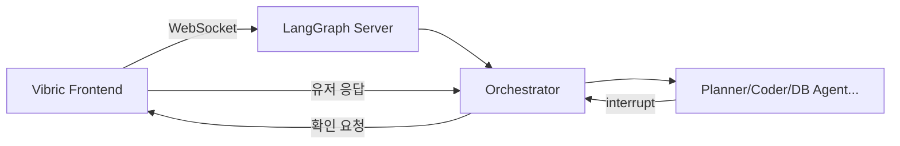

# Multi 모드 설계

## 개요
기존 Spec 모드를 삭제하고, LangGraph 멀티에이전트 시스템을 "Multi 모드"로 연동

---

## 핵심 결정 사항

| 항목 | 결정 |
|------|------|
| 모드 이름 | Spec → **Multi** |
| 연동 방식 | WebSocket (FastAPI + LangGraph) |
| 에이전트 확인 | interrupt 기반 → 인라인 UI |
| UI 변경 | 기존 Spec 관련 완전 삭제 후 재구축 |

---

## 아키텍처



---

## Phase 1: 기존 Spec 모드 삭제

### [DELETE] 삭제할 파일들
- `src/stores/spec-store.ts`
- `src/components/spec/SpecPanel.tsx`
- `src/components/chat/SpecWorkflowIndicator.tsx`

### [MODIFY] 정리할 파일들
- `src/stores/chat-store.ts` - Spec 관련 상태 제거
- `src/components/shell/AgentChat.tsx` - Spec 로직 제거
- `src/constants/prompts.ts` - Spec 프롬프트 제거

---

## Phase 2: Multi 모드 스토어

### [NEW] `src/stores/multi-store.ts`
```typescript
interface MultiState {
  isConnected: boolean
  currentAgent: string | null
  pendingConfirmation: AgentConfirmation | null
  artifacts: Record<string, string>
  messages: MultiMessage[]
}

interface AgentConfirmation {
  agent: string
  instruction: string
  targetFiles: string[]
}
```

---

## Phase 3: WebSocket 연동

### [NEW] `src/lib/langgraph-client.ts`
```typescript
class LangGraphClient {
  connect(url: string): void
  sendMessage(content: string): void
  confirmAgent(confirm: boolean): void
  onMessage(handler: MessageHandler): void
  onInterrupt(handler: InterruptHandler): void
}
```

### [NEW] `agents/server.py` (Python)
FastAPI + WebSocket 서버

---

## Phase 4: 인라인 확인 UI

### [NEW] `src/components/chat/AgentConfirmation.tsx`
```
AI: "버튼 색상 변경을 위해 Coder를 호출합니다."
    [✓ 진행] [✕ 취소] [🔄 다른 에이전트]
```

---

## Phase 5: 채팅 UI 수정

### [MODIFY] `src/components/shell/AgentChat.tsx`
- inputMode에서 'spec' → 'multi' 변경
- WebSocket 연결 로직 추가
- AgentConfirmation 렌더링

---

## Verification Plan

1. Spec 모드 삭제 후 빌드 확인
2. WebSocket 연결 테스트
3. 에이전트 확인 플로우 테스트
4. 전체 E2E 테스트
